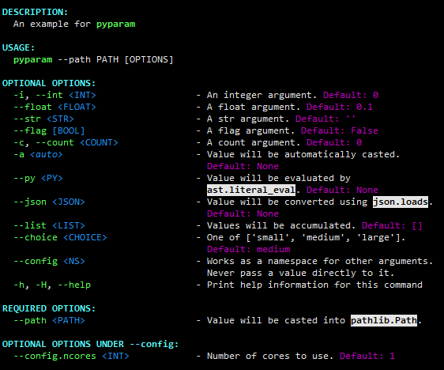

# pyparam
[![pypi][1]][2] [![pypi][10]][11] [![docs][18]][19] ![github action][3] [![codacy quality][5]][6] [![codacy quality][7]][6] ![pyver][8]

Powerful parameter processing

## Features
- Command line argument parser (with subcommand support)
- Rich type support, including `py`, `json`, `namespace`, etc.
- Type overwriting for parameters from command line
- Arbitrary parsing arguments from command line
- Automatic help page assembling
- Help page customization
- Callbacks for option values
- Parameter loading from configuration files

## Installation
```shell
pip install -U pyparam
```

## Documentation
[ReadTheDocs][19]

## Basic usage

`example.py`

```python
from rich import print
from pyparam import Params
# program name, otherwise sys.argv[0]
params = Params(prog='pyparam', desc="An example for {prog}")
# adding parameters
params.add_param('i, int', type=int,
                 desc="An integer argument.")
params.add_param('float', default=0.1, # type float implied
                 desc="A float argument.")
params.add_param('str', type=str,
                 desc="A str argument.")
params.add_param('flag', type=bool,
                 desc="A flag argument.")
params.add_param('c,count', type='count',
                 desc="A count argument.")
params.add_param('a', type='auto', type_frozen=False,
                 desc="Value will be automatically casted.")
params.add_param('py', type='py',
                 desc="Value will be evaluated by `ast.literal_eval`.")
params.add_param('json', type='json',
                 desc="Value will be converted using `json.loads`.")
params.add_param('list', type='list',
                 desc="Values will be accumulated.")
params.add_param('path', type='path', required=True,
                 desc="Value will be casted into `pathlib.Path`.",
                 callback=( # check if path exists
                     lambda path: ValueError('File does not exist.')
                     if not path.exists() else path
                 ))
params.add_param('choice', type='choice', default='medium',
                 choices=['small', 'medium', 'large'],
                 desc="One of {choices}.")
params.add_param('config.ncores', default=1, # namespace config implied
                 argname_shorten=False,
                 desc='Number of cores to use.')

print(vars(params.parse()))
```

Try it out:
```sh
$ python example.py
```



```sh
$ python example.py \
    -i2 \
    --float 0.5 \
    --str abc \
    -ccc \
    -a:int 1 \
    --py "{1,2,3}" \
    --json "{\"a\": 1}" \
    --list 1 2 3 \
    --choice large \
    --path . \
    --config.ncores 4
```
```python
{
    'i': 2,
    'int': 2,
    'float': 0.5,
    'str': 'abc',
    'flag': False,
    'c': 3,
    'count': 3,
    'a': 1,
    'py': {1, 2, 3},
    'json': {'a': 1},
    'list': [1, 2, 3],
    'path': PosixPath('.'),
    'choice': 'large',
    'config': Namespace(ncores=4)
}
```

Try more features with:
```sh
$ python -m pyparam
```

## TODO:
- [ ] More flexible and handy API for help page manipulation.
- [ ] Shell completion.


[1]: https://img.shields.io/pypi/v/pyparam.svg?style=flat-square
[2]: https://pypi.org/project/pyparam/
[3]: https://img.shields.io/github/workflow/status/pwwang/pyparam/build?style=flat-square
[5]: https://img.shields.io/codacy/grade/a34b1afaccf84019a6b138d40932d566.svg?style=flat-square
[6]: https://app.codacy.com/project/pwwang/pyparam/dashboard
[7]: https://img.shields.io/codacy/coverage/a34b1afaccf84019a6b138d40932d566.svg?style=flat-square
[8]: https://img.shields.io/pypi/pyversions/pyparam.svg?style=flat-square
[9]: https://raw.githubusercontent.com/pwwang/pyparam/master/docs/static/help.png
[10]: https://img.shields.io/github/tag/pwwang/pyparam.svg?style=flat-square
[11]: https://github.com/pwwang/pyparam
[18]: https://img.shields.io/readthedocs/pyparam.svg?style=flat-square
[19]: https://pyparam.readthedocs.io/en/latest/
